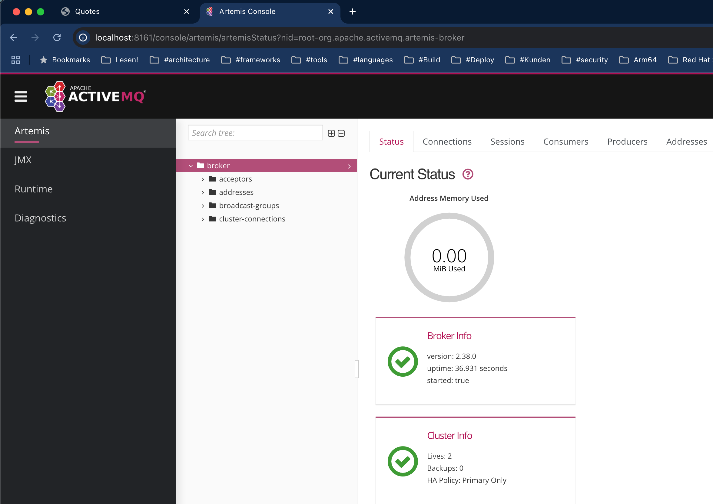

# Die GUI zu Artemis

Im [docker-compose.yml](deploy/simple/docker-compose.yml) sind die Ports auf den Host gemappt und jolokia CORS Prüfung abgeschwächt:

    environment:
      AMQ_EXTRA_ARGS: "--relax-jolokia"

    ports:
      - "8161:8161"

Dann kann unter
die console aufgerufen werden:

- im Browser http://localhost:8161
- login mit `admin` : `admin`
- erscheint:

## Red Hat AMQ7 Images

Bei diesen images muss cors in der [jolokia-access.xml](./deploy/custom/jolokia-access.xml) abgeschaltet werden:

    <cors>
        <!-- Allow cross-origin access from the origins that match the following pattern ... -->
        <allow-origin>http://localhost:8161/*</allow-origin>
    <cors>

## Links

- Redhat AMQ7
 - https://docs.redhat.com/en/documentation/red_hat_amq/7.4/html-single/managing_amq_broker/index#securing-console-broker-connections-managing